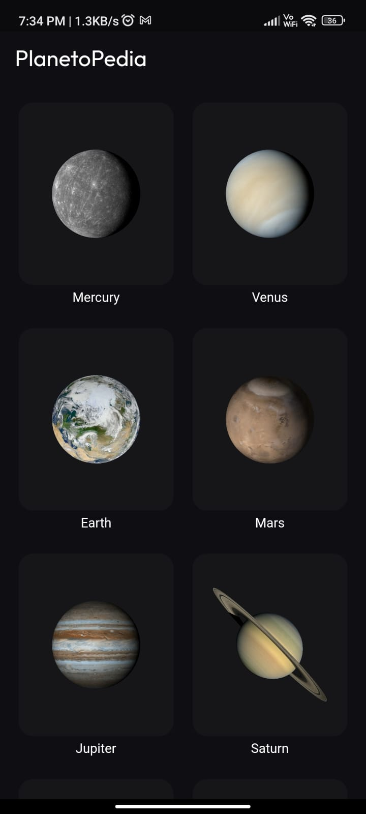
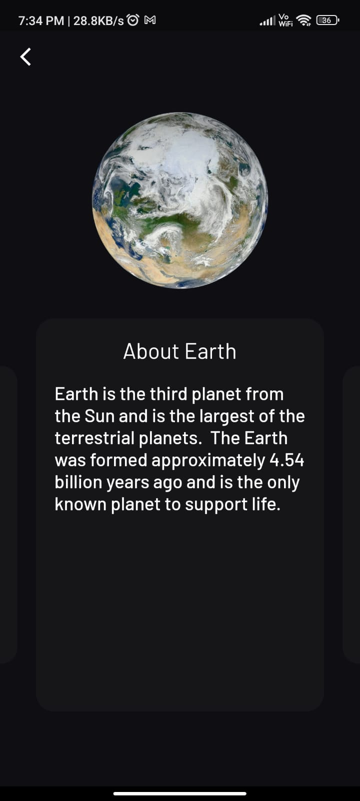
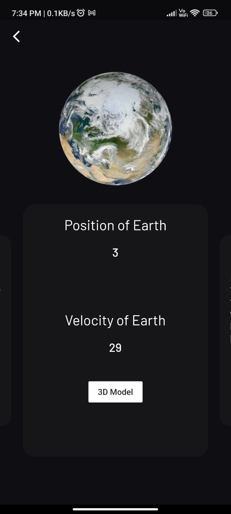
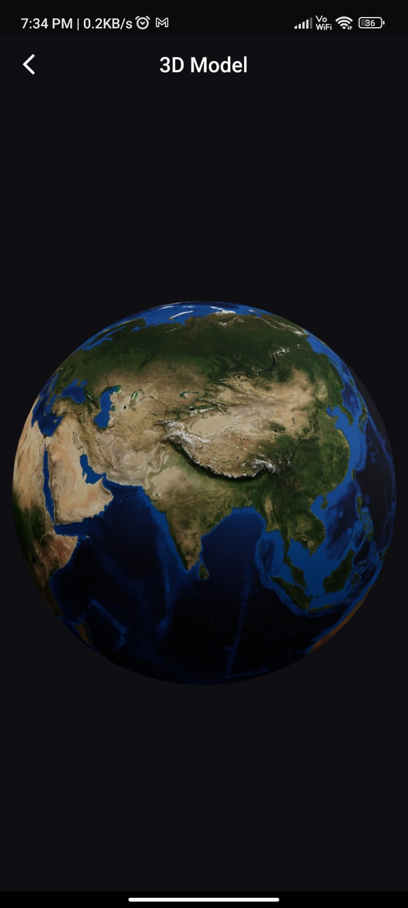

# Planetopedia

An app to visualize the entire solar system served right at your finger-tips.


## Installation

Install Planetopedia

Clone this repository using the following command

```bash
  git clone
```

Keeping in mind you have flutter installed, now start the build process.

After the termination of build process, make the flutter app using the following code:

```bash
  flutter build apk --split-per-abi
```

You will find the app being present in the output folder inside the android directory.

Install it in your device and enjoy!!!


## Demo

The below images are taken directly from the app.








